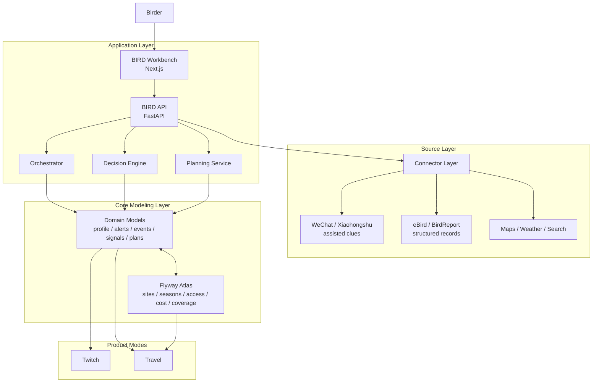
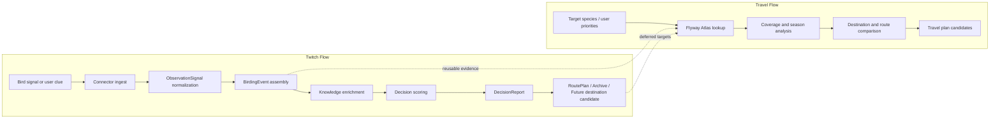

# BIRD

`BIRD (Birding Intelligent Route Designer)` is a birding decision and planning system built for more sustainable and systematic birding.

It helps turn scattered bird records, route constraints, seasonal knowledge, and personal priorities into usable birding plans, from short-horizon twitching decisions to lifetime-scale travel planning.

BIRD is organized around two core modes:

- `Twitch`: short-horizon rare-bird chasing and opportunity-window decisions
- `Travel`: long-horizon birding travel and lifetime-scale planning

Both modes are backed by the `Flyway Atlas`, a growing modeling layer for birding sites, seasonal windows, access conditions, travel cost, and coverage value.

The current repository implements the `Twitch` prototype and lays the foundation for `Travel` and the `Flyway Atlas`.

This repository currently contains a `v0.1` monorepo prototype with:

- `apps/api`: FastAPI backend with Birding domain models, connector stubs, a rule-based decision engine, and sample v1 APIs
- `apps/web`: Next.js workbench for alerts, events, future destinations, profile, and archive
- `packages/shared`: shared TypeScript contracts and mock domain data for frontend development
- `docs`: PRD, architecture notes, and versioning rules

## System Architecture



## Core Planning Flows



## Why BIRD

- `Systematic birding`: plan around evidence, timing, access, and long-term goals instead of isolated impulse decisions
- `Sustainable birding`: make better use of limited time, money, and energy, and reduce wasteful or low-value travel
- `One continuous workflow`: move from `should I go now?` to `where should I go next?` to `how do I document what this meant?`

## What Is Implemented

- A `Twitch` workbench focused on `alert -> evidence -> decision -> planning -> archive`
- Canonical domain models for users, alerts, observation signals, decisions, route plans, and future destinations
- A sample `白斑军舰鸟` event showing how BIRD should reason about `GO / GO_WITH_RISK / SKIP / SAVE_FOR_FUTURE_TRIP`
- Connector abstractions for `WeChat`, `Xiaohongshu`, `eBird`, `BirdReport`, search, maps, and weather
- A rule-driven decision engine that scores travel cost, stability, timing, weather, schedule conflict, rarity, and future trip alternatives
- Product and engineering documentation for roadmap, versioning, and release management

## Product Direction

The next major product pillar is `Travel`, which expands BIRD from immediate twitching decisions to lifetime-scale birding coverage planning.

At the center of `Travel` is the `Flyway Atlas`:

- internally, the atlas and optimization infrastructure for world-scale birding planning
- externally, the flagship narrative that helps users imagine and generate their own personalized path across a limited birding life

This means `Flyway Atlas` is both:

- a foundation for long-distance planning
- a user-facing growth hook that invites customization rather than a fixed universal route

## Chinese Overview

For a short Chinese introduction, see [docs/README.zh-CN.md](docs/README.zh-CN.md).

## Repository Scope

- This repository is a `personal-use / research prototype`.
- Third-party sources such as `eBird`, `BirdReport`, maps, weather, and social platforms remain subject to their own terms of use.
- The repository does not include private API keys, cookies, private chat exports, or restricted raw data dumps.
- Example records and mock users are intentionally synthetic.

## Repository Layout

```text
apps/
  api/        FastAPI backend
  web/        Next.js frontend
packages/
  shared/     Shared TS types and mock data
docs/         Product and engineering docs
```

## Quick Start

### Backend

```bash
python3 -m venv .venv
source .venv/bin/activate
python3 -m pip install -e apps/api
uvicorn app.main:app --reload --app-dir apps/api
```

### Frontend

```bash
npm install
npm run dev:web
```

Set `NEXT_PUBLIC_BIRD_API_URL=http://127.0.0.1:8000` to have the frontend call the local backend. Without it, the web app falls back to bundled mock data.

## Key Endpoints

- `GET /api/v1/dashboard`
- `GET /api/v1/alerts`
- `GET /api/v1/events/{event_id}`
- `GET /api/v1/future-destinations`
- `GET /api/v1/profile`
- `GET /api/v1/archive`
- `GET /api/v1/connectors`
- `GET /api/v1/connector-configs`
- `PUT /api/v1/connector-configs/{source_name}`
- `GET /api/v1/connectors/ebird/recent-observations`
- `GET /api/v1/connectors/ebird/hotspots`
- `POST /api/v1/signals/ingest`

## Docs

- [Chinese Overview](docs/README.zh-CN.md)
- [PRD](docs/PRD.md)
- [Travel / World Planning](docs/WORLD_MODE_PRD.md)
- [Flyway Atlas v1 Schema](docs/FLYWAY_ATLAS_V1_SCHEMA.md)
- [Architecture](docs/ARCHITECTURE.md)
- [Versioning](docs/VERSIONING.md)
- [Connector Setup](docs/CONNECTOR_SETUP.md)
